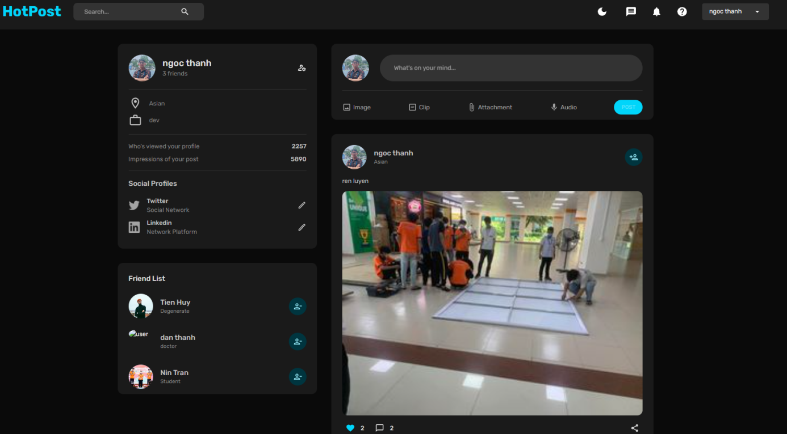

# 🔥🔥 HotPost Social Media

HotPost is a social media website that allows people to connect, communicate and share information with others online. With the explosion of the internet and the growth of social networks, the world has become more interconnected than ever before. This project aims to create a social media platform that provides a safe and engaging space for people to connect with each other.

Star⭐ the repo if you like what you see😉.

Note: The unit test folder are stored in Backend

 

## ✨ Requirements

- Any Operating System (ie. MacOS X, Linux, Windows)
- Any IDE with npm installed (VSCode is recommended)
- A brain to think I guess.. 🤓🤓

## Features
- Custom photo feed
- Post photo posts from camera or gallery
  - Like posts
  - Comment on posts
    - View all comments on a post
- Search for users
- Realtime Messaging and Sending images
- Deleting Posts
- Profile Pages
  - Change profile picture
  - Change username
  - Follow / Unfollow Users
  - Change image view from grid layout to feed layout
  - Add your own bio
- Notifications Feed showing recent likes / comments of your posts + new followers
- Swipe to delete notification
- Dark Mode Support
- Stories/Status
- Used Provider to manage state

## Author(s)

License from Team Pixel

| Stt | Mã sinh viên | Tên                                                               |
| --- | ------------ | ----------------------------------------------------------------- |
| 1   | 1911065247   | [Trần Chấn Hưng](https://www.facebook.com/chanhung.ninzy/)        |
| 2   | 1911160680   | [Ngô Nguyễn Ngọc Thành](https://www.facebook.com/dong.ngo.77770/) |
| 3   | 1911065880   | [Lê Hoàng Minh Tuấn](https://www.facebook.com/cuabequyen/)        |
